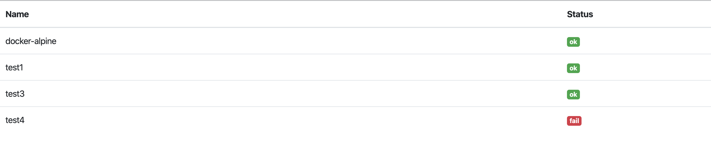

# Mini monitor

This is a small a standalone status page for multiple service checks.
(Like Nagios just much dumber.)

## Build

Simply run the following command:

```
$ go build src/cmd/monitor/monitor.go
```

## Run

```
$ monitor -listen :8080 -config config.json
```

By default the web UI will listen on `localhost:8080`.

You could open the following URLs in your browser:
- `/` - HTML web UI
- `/api` - JSON based status endpoint

Web UI example:


JSON response structure:
```
{
   "checks":{
      "docker-alpine":false,
      "test1":true,
      "test3":true,
      "test4":false
   }
}
```


## Configuration

Put a json file with a similar content like:
```
{
  "checkTime": "5s",
  "configs": [
    {
      "name": "unique-config-name",
      "type": "debug",
      "config": {
        "testKey": "testVal"
      }
    },
    ...
  ]
}
```

Here the fields are the following:
 - `name` is the modules name you'd like to use, it should be unique in the config
 - `type` should be the checkers type, see the available ones below
 - `config` is the given modules configuration

### Available checkers

#### Debug

Obviously for debugging purpose.

Type definition: `debug`

Possible keys:
 - `loadFail` (bool) triggers an error on module load
 - `checkFail` (bool) tiggers and error at the check call


#### Docker

Basic docker container checker using the `docker ps` command.

Type definition: `docker`

Possible keys:
 - `id` (string) is the container id check
 - `nameRegex` (string) is the regular expression to match on a container's name
 - `imageRegex` (string) is the regular expression to match on an image's name
 - `debug` (bool) is for help the regular expression debugging

They are all optional and will match these fields to the `docker ps` output, but be careful if there are multiple matches it'll grab and check the first match only!
(Use the `id` if you'd like to guarantee to have a single match or use unique container names.)
